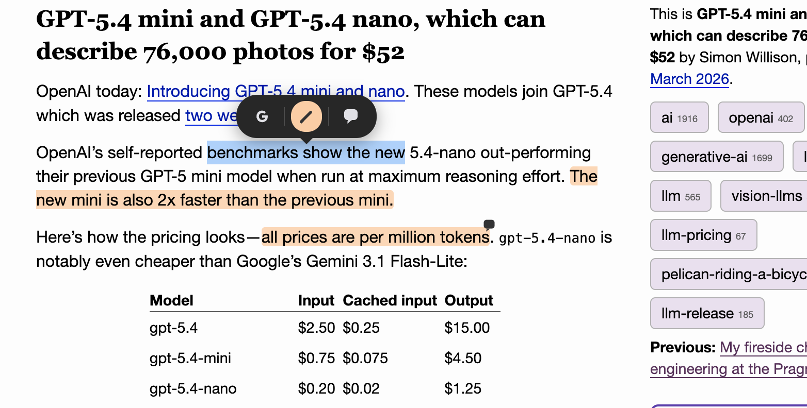

# Super Simple Highlighter (Fork)

This is a fork of [Super Simple Highlighter](https://github.com/nicholasgasior/super-simple-highlighter) by [Dexterous Logic](http://dexterouslogic.com) (Copyright 2014-2017).

A Chrome extension for highlighting text on web pages, with automatic restoration of highlights on each page revisit.

## Selection toolbar

When you select text on a page, the extension shows a floating toolbar positioned near the cursor location for quick actions:

- **Google search**: Open a new tab to search Google for the selected text
- **Highlight**: Save the selection with your active highlight color
- **Comment & highlight**: Create a highlight and attach a comment to it for later review
- **AI search**: Open a new tab to search your configured AI target with the selected text



## Changes in this fork

- **Manifest V3 migration**: Upgraded from MV2 to MV3 (service worker, `chrome.scripting` API, etc.)
- **PING rejection fix**: Content script injection now handles rejected PING messages correctly, allowing the inject-then-retry flow to work
- **PouchDB MV3 CSP fix**: Replaced `db.query()` (map/reduce) with `db.allDocs()` + in-memory filtering to avoid `Function()` calls blocked by MV3's strict Content Security Policy
- **E2E tests**: Added Playwright-based end-to-end tests for highlight creation and persistence
- **Selection toolbar**: Added quick actions for Google search, highlight creation, highlight comments, and AI search, positioned near the cursor location with the AI action as the fourth button

## Installation

Load as an unpacked extension in Chrome:

1. Navigate to `chrome://extensions/`
2. Enable "Developer mode"
3. Click "Load unpacked" and select this directory

## Testing

```bash
npm install
npx playwright install chromium
npx playwright test
```

## License

This project is licensed under the **GNU General Public License v3.0** (or later), the same license as the original project. See [LICENSE](LICENSE) for the full text.

The original license and copyright notices have been preserved in full.

### Third-party assets

- [Highlighter Blue Icon](http://www.iconarchive.com/show/soft-scraps-icons-by-hopstarter/Highlighter-Blue-icon.html) by [Hopstarter](http://hopstarter.deviantart.com) — [CC BY-NC-ND 3.0](http://creativecommons.org/licenses/by-nc-nd/3.0/)
- [Exclamation Icon](https://www.iconfinder.com/icons/32453/alert_attention_danger_error_exclamation_hanger_message_problem_warning_icon) by [Aha-soft](http://www.aha-soft.com/) — [CC BY 3.0](http://creativecommons.org/licenses/by/3.0/)
